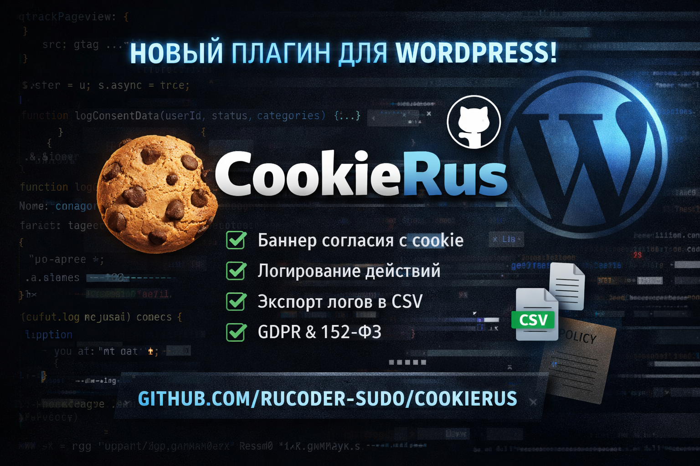

# 🍪 CookieRus - Cookie Consent Manager for WordPress

[Русская версия](#-cookierus--менеджер-согласия-с-cookie-для-wordpress) | [English version](#-cookierus--cookie-consent-manager-for-wordpress)

---

  

## 🇷🇺 CookieRus - менеджер согласия с cookie для WordPress

**CookieRus** - это полнофункциональный плагин для WordPress, предназначенный для управления согласием пользователей на использование файлов cookie в соответствии с требованиями **152-ФЗ**, **GDPR** и **ePrivacy**.

Плагин предоставляет гибкий баннер согласия, расширенные настройки категорий cookie, логирование действий пользователей и удобную выгрузку логов для администраторов сайта.

---

### 🚀 Основные возможности

#### 🍪 Баннер согласия с cookie
- Информативный баннер при первом посещении сайта
- Кнопки: **Принять все**, **Отклонить**, **Настроить**
- Модальное окно с подробным описанием категорий cookie
- Полная настройка текстов из админ-панели WordPress

---

### ⚙️ Категории cookie

#### **Необходимые (Всегда активные)**
- Обеспечивают базовую работу сайта
- Не могут быть отключены
- Не хранят персональные данные

#### **Функциональные**
- Социальные сети
- Виджеты и сторонние функции сайта  
- Возможность указать используемые сервисы

#### **Аналитика**
- Анализ поведения пользователей
- Источники трафика, количество посетителей, показатель отказов  
- Примеры сервисов: **Яндекс Метрика**, **Google Analytics**

#### **Производительность**
- Анализ производительности сайта
- Улучшение пользовательского опыта

#### **Реклама**
- Персонализированная реклама
- Анализ эффективности рекламных кампаний

👉 Для **каждой категории** можно указать конкретные сервисы.

---

### 📊 Менеджер логов согласия

- Логирование всех действий пользователей
- Хранение данных в базе данных WordPress
- Просмотр последних 100 записей в админ-панели
- Фиксируются:
  - Дата и время
  - IP-адрес
  - Страна
  - UID пользователя
  - Статус согласия
  - Выбранные категории cookie

#### 📁 Экспорт логов в CSV
- Кнопка **«Выгрузить логи (CSV)»**
- Файл совместим с Excel
- Кодировка **UTF-8 с BOM** (корректная кириллица)
- Выгружается вся история согласий

#### ℹ️ Информация для администратора
- Логи хранятся в базе данных WordPress
- В интерфейсе указано точное имя таблицы (например: `wp_cookierus_logs`)

---

### 📜 Генератор политики cookie
- Встроенный генератор политики использования cookie
- Соответствие требованиям **152-ФЗ**
- Удобен для быстрого добавления на сайт

---

### 🧠 Панель управления
- Статус баннера
- Состояние логирования
- Готовность базы данных
- AJAX-логирование
- Статистика пользовательских решений

---

### ✅ Статус проекта
- Все функции протестированы
- Логирование работает корректно
- Экспорт CSV исправен
- Готово к использованию в продакшене

---

### 🛠️ Подходит для
- Корпоративных сайтов
- Интернет-магазинов
- Лендингов
- Проектов с требованиями 152-ФЗ / GDPR

---

### 📌 Лицензия
GPL v2 or later

---

---

## 🇺🇸 CookieRus — Cookie Consent Manager for WordPress

**CookieRus** is a full-featured WordPress plugin designed to manage user consent for cookies in compliance with **GDPR**, **ePrivacy**, and Russian **152-FZ** regulations.

It provides a customizable cookie banner, detailed consent categories, user action logging, and convenient export tools for site administrators.

---

### 🚀 Features

#### 🍪 Cookie Consent Banner
- Displays on the user’s first visit
- Buttons: **Accept all**, **Reject**, **Customize**
- Modal window with detailed cookie category descriptions
- Fully customizable texts via WordPress admin panel

---

### ⚙️ Cookie Categories

#### **Necessary (Always Active)**
- Required for core website functionality
- Cannot be disabled
- Do not store personal data

#### **Functional**
- Social media platforms
- Third-party widgets and features  
- Ability to specify used services

#### **Analytics**
- Helps understand user behavior
- Traffic sources, visitors, bounce rate  
- Examples: **Google Analytics**, **Yandex Metrica**

#### **Performance**
- Website performance measurement
- Improves user experience

#### **Advertisement**
- Personalized advertising
- Ad campaign effectiveness analysis

👉 Each category supports listing specific services.

---

### 📊 Consent Log Manager

- Logs all user consent actions
- Data stored in WordPress database
- Displays the latest 100 records
- Logged data includes:
  - Date & time
  - IP address
  - Country
  - User UID
  - Consent status
  - Selected categories

#### 📁 CSV Export
- **Export logs (CSV)** button
- Excel-compatible file
- UTF-8 BOM encoding for correct character display
- Full consent history export

#### ℹ️ Admin Information
- Clearly states where logs are stored
- Shows the exact database table name (e.g. `wp_cookierus_logs`)

---

### 📜 Cookie Policy Generator
- Built-in cookie policy generator
- Helps meet legal requirements
- Quick integration into any website

---

### 🧠 Admin Dashboard
- Banner status
- Logging status
- Database readiness
- AJAX logging
- User consent statistics

---

### ✅ Project Status
- Fully tested
- Production-ready
- Stable logging and export

---

### 🛠️ Suitable for
- Corporate websites
- E-commerce stores
- Landing pages
- GDPR / legal compliance projects

---

### 📌 License
GPL v2 or later
