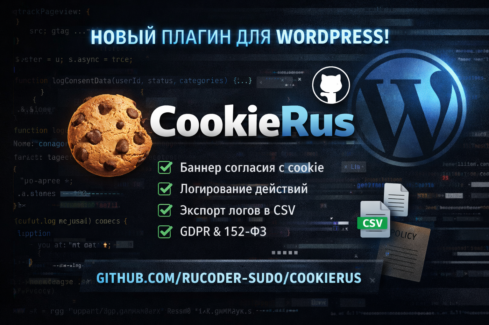

# CookieRus Cookie Consent Manager for WordPress

[Русская версия](#-cookierus--менеджер-согласия-с-cookie-для-wordpress) | [English version](#-cookierus--cookie-consent-manager-for-wordpress)

---

  

## 🇷🇺 CookieRus менеджер согласия с cookie для WordPress

**CookieRus** это полнофункциональный плагин для WordPress, предназначенный для управления согласием пользователей на использование файлов cookie в соответствии с требованиями **152-ФЗ**, **GDPR** и **ePrivacy**.

Плагин предоставляет гибкий баннер согласия, расширенные настройки категорий cookie, логирование действий пользователей и удобную выгрузку логов для администраторов сайта.

---

### Основные возможности

#### Баннер согласия с cookie
- Информативный баннер при первом посещении сайта
- Кнопки: **Принять все**, **Отклонить**, **Настроить**
- Модальное окно с подробным описанием категорий cookie
- Полная настройка текстов из админ-панели WordPress

---

### Категории cookie

#### **Необходимые (Всегда активные)**
- Обеспечивают базовую работу сайта
- Не могут быть отключены
- Не хранят персональные данные

#### **Функциональные**
- Социальные сети
- Виджеты и сторонние функции сайта  
- Возможность указать используемые сервисы

#### **Аналитика**
- Анализ поведения пользователей
- Источники трафика, количество посетителей, показатель отказов  
- Примеры сервисов: **Яндекс.Метрика** и другие подключенные сервисы

#### **Производительность**
- Анализ производительности сайта
- Улучшение пользовательского опыта

#### **Реклама**
- Персонализированная реклама
- Анализ эффективности рекламных кампаний

Для **каждой категории** можно указать конкретные сервисы.

---

### Менеджер логов согласия

- Логирование всех действий пользователей
- Хранение данных в базе данных WordPress
- Просмотр последних 100 записей в админ-панели
- Фиксируются:
  - Дата и время
  - IP-адрес
  - Страна
  - UID пользователя
  - Статус согласия
  - Выбранные категории cookie

#### Экспорт логов в CSV
- Кнопка **«Выгрузить логи (CSV)»**
- Файл совместим с Excel
- Кодировка **UTF-8 с BOM** (корректная кириллица)
- Выгружается вся история согласий

#### Информация для администратора
- Логи хранятся в базе данных WordPress
- В интерфейсе указано точное имя таблицы (например: `wp_cookierus_logs`)

---

### Панель управления
- Статус баннера
- Состояние логирования
- Готовность базы данных
- AJAX-логирование
- Статистика пользовательских решений

---

### Изменения в версии 1.1.3
- **Исправлено:** вложенность карточек настроек — разделы больше не объединяются в один визуальный блок.
- **Улучшено:** модальное окно «Настроить» стало широким, структурированным и адаптивным для desktop и мобильных устройств.
- **Изменено:** на вкладке «Информация» оставлена подпись «Разработчик плагина CookieRus» без персональных контактных данных.

### Изменения в версии 1.1.2
- **Добавлено:** строгая многоуровневая блокировка аналитики и маркетинговых трекеров до нажатия кнопки согласия, включая статические и динамические скрипты, DOM-узлы, изображения, iframe, fetch, XMLHttpRequest и sendBeacon.
- **Добавлено:** свои категории согласия с названием, описанием, ссылкой на политику и отдельным переключателем в модальном окне «Настроить».
- **Добавлено:** свои цели обработки с заголовком, описанием и включением или выключением в настройках.
- **Добавлено:** поле для вставки Callibri-кода с запуском только после согласия на аналитику.
- **Исправлено:** отложенные inline-скрипты после согласия теперь запускаются через новый элемент `script`.
- **Исправлено:** Callibri-виджет и его сетевые запросы не запускаются до разрешения аналитики.
- **Добавлено:** настройка полного запрета авторизации через иностранные OAuth/social-login сервисы, включая AJAX, шапку сайта и динамические кнопки.
- **Добавлено:** цели «Ретаргетинг», «Создание профиля пользователя» и «Передача данных третьим лицам».
- **Добавлено:** срок хранения функциональных cookie, ссылки на политики категорий, кнопка отзыва согласия и очистка логов старше одного года.
- **Исправлено:** новые настройки мигрируют на существующие установки без перезаписи выбора администратора.
- **Исправлено:** версия 1.1.2 и название «Колибри» выровнены в админке, баннере и документации.

### Изменения в версии 1.1.1
- Исправлена критическая ошибка регистрации: вместо отсутствующего метода `WP_Error::get_error()` используется штатный `WP_Error::get_error_codes()`.

### Изменения в версии 1.1.0
- Сторонний менеджер тегов и связанные с ним настройки полностью удалены.
- В окно «Настройки согласия» добавлена вкладка «Упоминания» с правилами регистрации и входа для сайта, WooCommerce и `/wp-admin/`.
- Регистрация, вход, изменение email и восстановление доступа ограничиваются российскими почтовыми доменами `mail.ru`, `yandex.ru`, `rambler.ru`, `bk.ru`, а также зонами `.ru`, `.su` и `.рф`.
- Исправлена очистка устаревших настроек трекеров при сохранении.
- Юридическая справка уточнена: плагин не заменяет проверку политики обработки данных, уведомлений и фактических мест хранения.

### Исправления в версии 1.0.8
- Технические ответы WordPress больше не изменяются HTML-кодом баннера CookieRus.
- До запуска буферизации пропускаются `robots.txt`, sitemap, RSS/Atom, REST API и XML-RPC.
- Если HTML-ответ не содержит закрывающий тег `</body>`, он возвращается без изменений.

---

### Статус проекта
- Все функции протестированы
- Логирование работает корректно
- Экспорт CSV исправен
- Готово к использованию в продакшене

---

### Подходит для
- Корпоративных сайтов
- Интернет-магазинов
- Лендингов
- Проектов с требованиями 152-ФЗ / GDPR

---

### 📌 Лицензия
GPL v2 or later

---

---

## 🇺🇸 CookieRus — Cookie Consent Manager for WordPress

**CookieRus** is a full-featured WordPress plugin designed to manage user consent for cookies in compliance with **GDPR**, **ePrivacy**, and Russian **152-FZ** regulations.

It provides a customizable cookie banner, detailed consent categories, user action logging, and convenient export tools for site administrators.

---

### 🚀 Features

#### 🍪 Cookie Consent Banner
- Displays on the user’s first visit
- Buttons: **Accept all**, **Reject**, **Customize**
- Modal window with detailed cookie category descriptions
- Fully customizable texts via WordPress admin panel

---

### ⚙️ Cookie Categories

#### **Necessary (Always Active)**
- Required for core website functionality
- Cannot be disabled
- Do not store personal data

#### **Functional**
- Social media platforms
- Third-party widgets and features  
- Ability to specify used services

#### **Analytics**
- Helps understand user behavior
- Traffic sources, visitors, bounce rate  
- Examples: **Yandex Metrica** and other connected services

#### **Performance**
- Website performance measurement
- Improves user experience

#### **Advertisement**
- Personalized advertising
- Ad campaign effectiveness analysis

👉 Each category supports listing specific services.

---

### 📊 Consent Log Manager

- Logs all user consent actions
- Data stored in WordPress database
- Displays the latest 100 records
- Logged data includes:
  - Date & time
  - IP address
  - Country
  - User UID
  - Consent status
  - Selected categories

#### 📁 CSV Export
- **Export logs (CSV)** button
- Excel-compatible file
- UTF-8 BOM encoding for correct character display
- Full consent history export

#### ℹ️ Admin Information
- Clearly states where logs are stored
- Shows the exact database table name (e.g. `wp_cookierus_logs`)

---

### 🧠 Admin Dashboard
- Banner status
- Logging status
- Database readiness
- AJAX logging
- User consent statistics

---

### Changes in version 1.1.3
- **Fixed:** settings cards no longer collapse into one combined visual block.
- **Improved:** the “Configure” modal is now wide, structured, and responsive on desktop and mobile.
- **Changed:** the Information tab now shows only “Разработчик плагина CookieRus” without personal contact details.

### Changes in version 1.1.2
- **Added:** strict multi-layer blocking of analytics and marketing trackers before consent, including static and dynamic scripts, DOM nodes, images, iframes, fetch, XMLHttpRequest, and sendBeacon.
- **Added:** custom consent categories with a title, description, privacy-policy link, and independent toggle in the “Configure” modal.
- **Added:** custom processing purposes with configurable title, description, and enabled state.
- **Added:** a Callibri code field that executes only after analytics consent.
- **Fixed:** deferred inline scripts now start through a new executable `script` element after consent.
- **Fixed:** the Callibri widget and its network requests cannot start before analytics consent.
- **Added:** an administrator setting to block foreign OAuth/social-login providers in AJAX, page headers, and dynamically loaded buttons.
- **Added:** the Retargeting, User profiling, and Third-party data transfer processing purposes.
- **Added:** configurable functional-cookie retention, service privacy-policy links, consent withdrawal, and deletion of logs older than one year.
- **Fixed:** new settings migrate to existing installations without overwriting administrator choices.
- **Fixed:** version 1.1.2 and the Callibri/«Колибри» naming are consistent across the UI and documentation.

### Changes in version 1.1.1
- Fixed a critical registration error by replacing the unavailable `WP_Error::get_error()` call with the standard `WP_Error::get_error_codes()` method.

### Changes in version 1.1.0
- The third-party tag manager and its related settings have been removed completely.
- The consent settings window now includes a “Mentions” tab covering registration and login rules for the site, WooCommerce, and `/wp-admin/`.
- Registration, login, email changes, and access recovery are limited to `mail.ru`, `yandex.ru`, `rambler.ru`, `bk.ru`, and the `.ru`, `.su`, and `.рф` zones.
- Stale tracker settings are removed when settings are saved.
- Legal guidance now clarifies that the plugin does not replace an operator’s full review of data-processing obligations.

### Fixes in version 1.0.8
- WordPress technical responses are no longer modified with CookieRus banner HTML.
- `robots.txt`, sitemaps, RSS/Atom, REST API, and XML-RPC are skipped before output buffering starts.
- HTML responses without a closing `</body>` tag are returned unchanged.

---

### ✅ Project Status
- Fully tested
- Production-ready
- Stable logging and export

---

### 🛠️ Suitable for
- Corporate websites
- E-commerce stores
- Landing pages
- GDPR / legal compliance projects

---

👨‍💻 Author: Sergey Soloshenko (RuCoder)
🛠 WordPress / Full Stack
📬 support@рукодер.рф
📲 Telegram: @RussCoder

If you need customization for a project or turnkey installation, write in private messages.

### 📌 License
GPL v2 or later
